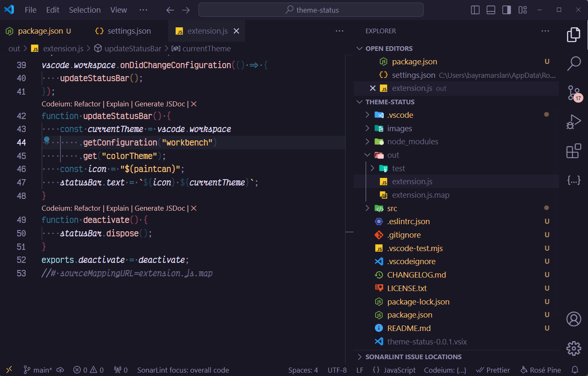

# VSCode Theme Display and Selector

VSCode Theme Display and Selector is a Visual Studio Code extension that displays the name of the active theme in the status bar and opens a theme selection list when clicked. With this extension, you can easily see the name of the active theme and quickly switch between themes.

## Features

- Displays the name of the current theme in the status bar.
- Opens a theme selection list when the theme name is clicked.
- I'm Feeling Lucky: Click on "I'm Feeling Lucky" in the status bar to randomly switch to a different theme.
